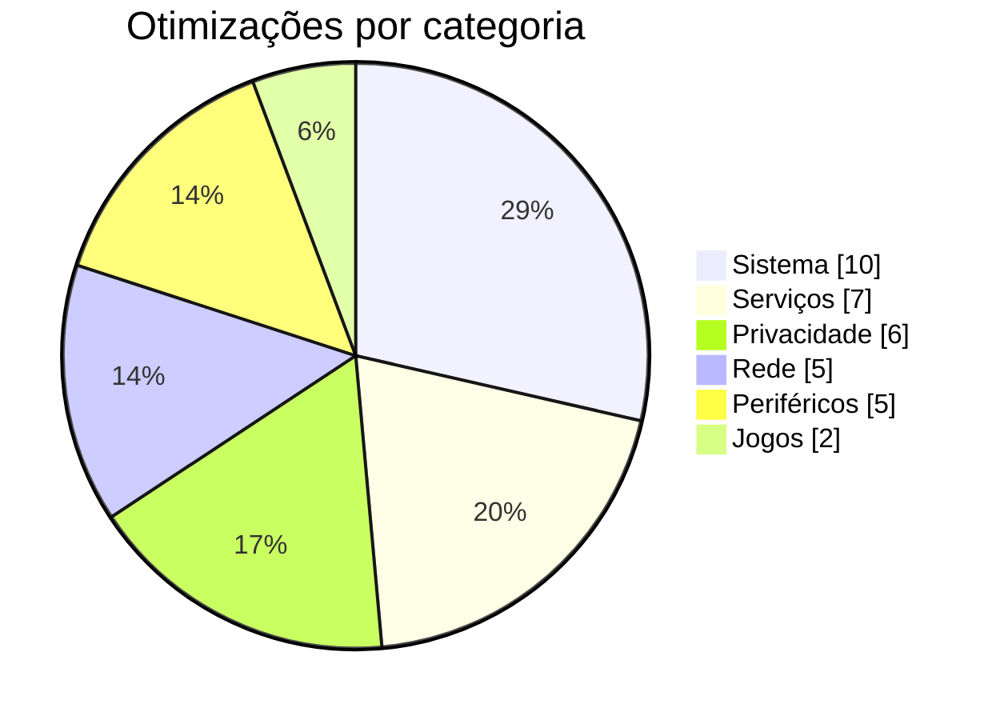
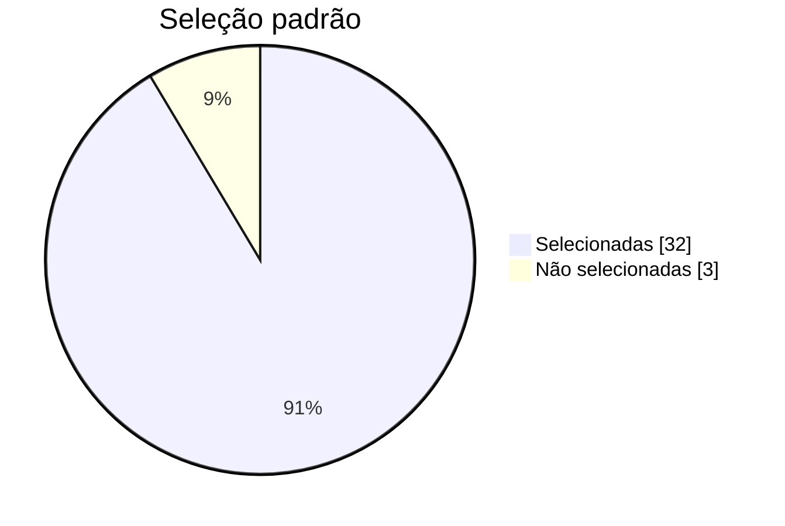
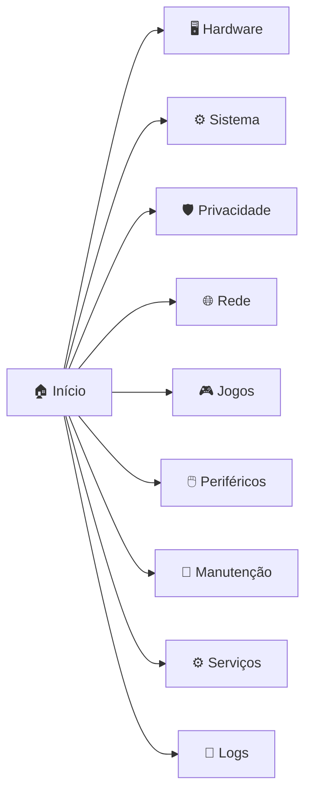
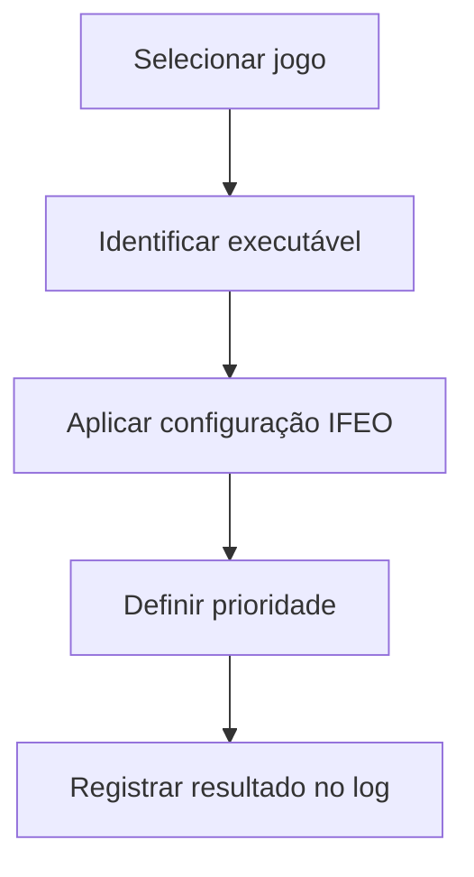
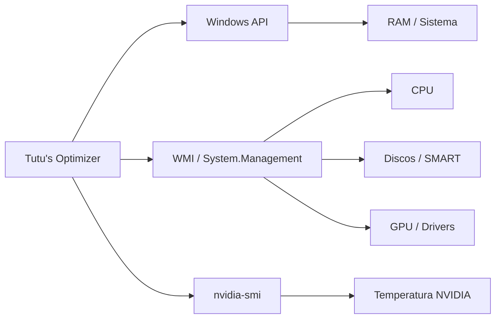
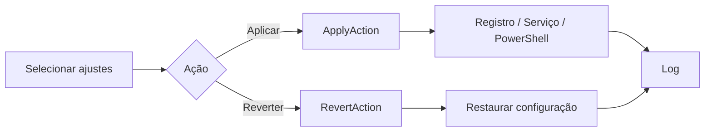
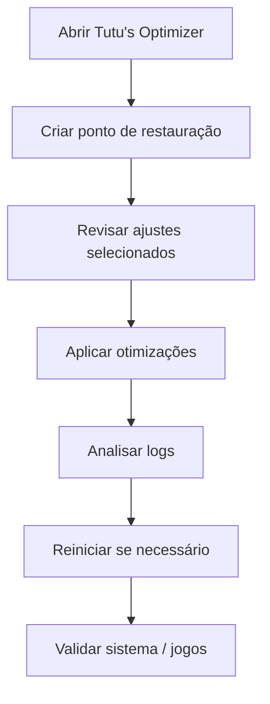
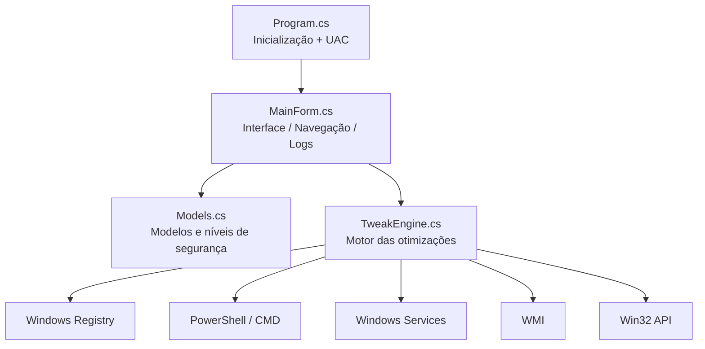
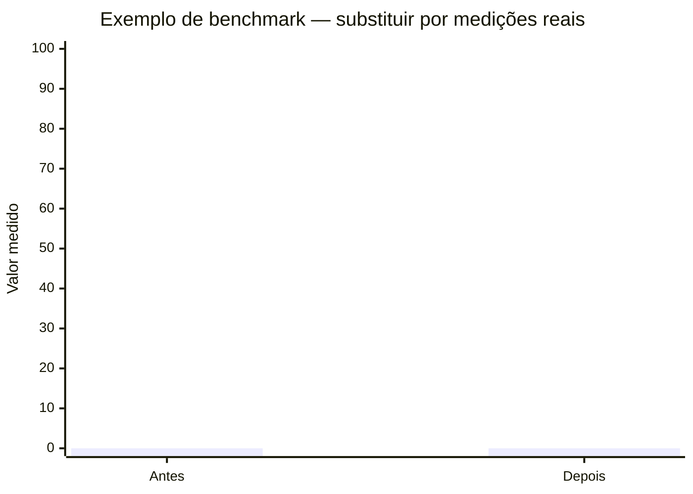

# ⚡ Tutu's Optimizer 2026

<p align="center">
  <strong>Otimizador local para Windows 10 e 11, com interface gráfica, monitoramento de hardware, manutenção e ajustes avançados em um único aplicativo.</strong>
</p>

<p align="center">
  
  
  
  
  
</p>

<p align="center">
  <b>35 otimizações</b> • <b>49 jogos cadastrados</b> • <b>34 ajustes reversíveis</b> • <b>Dark / Light Mode</b>
</p>

---

## 📌 Sobre o projeto

O **Tutu's Optimizer** é uma aplicação desktop para **Windows 10 e Windows 11** criada para centralizar otimizações, manutenção, diagnóstico e monitoramento do sistema em uma interface gráfica simples.

A nova versão abandona a experiência baseada apenas em scripts e menus de terminal e passa a funcionar como um **aplicativo local completo em C# / Windows Forms**, com navegação por categorias, seleção individual de ajustes, execução em segundo plano, progresso visual, logs detalhados e ferramentas de reversão.

O objetivo do projeto é permitir que o usuário tenha mais controle sobre configurações do Windows que normalmente ficam espalhadas entre Registro, PowerShell, serviços, políticas do sistema e ferramentas administrativas.

> [!IMPORTANT]
> O Tutu's Optimizer altera configurações do Windows. Algumas opções podem não ser apropriadas para todos os computadores ou fluxos de trabalho. Leia a descrição de cada ajuste antes de aplicá-lo.

---

## ✨ Destaques desta versão

- 🖥️ **Interface gráfica totalmente local**
- 🌙 **Tema claro e escuro**, detectado automaticamente a partir do Windows
- ⚡ **Otimização rápida recomendada**
- 🎛️ **35 ajustes individuais**, organizados por categoria
- ↩️ **34 ajustes com suporte a reversão**
- 🎮 **Catálogo com 49 jogos**
- 🔎 **Pesquisa e inclusão manual de executáveis de jogos**
- 🧠 **Informações de CPU e memória**
- 🎮 **Informações de GPU e driver**
- 💾 **Monitoramento de SSD/HDD e SMART quando disponível**
- 🌡️ **Leitura de temperatura quando exposta pelo hardware/driver**
- 🧹 **Ferramentas de manutenção e limpeza**
- 🛡️ **Criação de ponto de restauração**
- 📜 **Console de logs em tempo real**
- 💾 **Exportação de logs para arquivo**
- 📌 **Integração com a bandeja do sistema**
- 🔐 **Solicitação automática de privilégios de Administrador**

---

## 📊 Visão geral da versão atual

| Informação | Quantidade / Estado |
| --- | ---: |
| Otimizações disponíveis | **35** |
| Marcadas por padrão | **32** |
| Classificadas como recomendadas | **31** |
| Classificadas como opcionais | **4** |
| Com suporte a reversão | **34** |
| Jogos cadastrados | **49** |
| Categorias de otimização | **6** |
| Ferramentas de manutenção dedicadas | **6** |
| Temas | **Claro + Escuro** |

### Distribuição das otimizações



### Estado padrão dos ajustes



> Os números acima representam o catálogo atualmente implementado no código desta versão.

---

## 🧭 Interface e navegação

A interface foi dividida em páginas específicas para reduzir a complexidade e facilitar a localização de cada recurso.



Na tela inicial, o aplicativo também apresenta informações resumidas sobre o computador, como:

- processador;
- memória RAM total e disponível;
- sistema operacional detectado;
- espaço livre no disco `C:`;
- saúde do armazenamento;
- estado da CPU;
- estado da GPU.

---

## 🎨 Novo visual

A nova interface foi construída utilizando **Windows Forms** e possui uma identidade visual própria.

### Principais características

- barra lateral para navegação;
- cards de informações e ações;
- indicadores de segurança;
- barra de progresso;
- scrollbars personalizadas;
- botões de seleção em massa;
- janela personalizada;
- integração com Dark Mode;
- console visual de execução.

O tema é detectado através da configuração do Windows:

```text
Windows em modo claro  → Tutu's Optimizer em modo claro
Windows em modo escuro → Tutu's Optimizer em modo escuro
```

A aplicação também utiliza recursos nativos do Windows para aplicar o modo escuro à janela e a componentes compatíveis.

---

## 🛡️ Níveis de segurança

Cada otimização possui um nível de segurança definido no código.

| Nível | Uso |
| --- | --- |
| 🟢 **Recomendado** | Ajustes destinados ao uso geral e selecionados automaticamente quando apropriado |
| 🟡 **Opcional** | Ajustes que dependem do hardware, software instalado ou forma de uso |
| 🔴 **Avançado** | Estrutura preparada para alterações de maior impacto |

Nesta versão, o catálogo contém:

```text
Recomendadas  ███████████████████████████████ 31
Opcionais     ████                             4
Avançadas                                      0
```

---

# 🛠️ Módulos de otimização

## ⚡ Sistema

**10 otimizações disponíveis**

Inclui ajustes relacionados a desempenho geral, agendamento de CPU, armazenamento e comportamento da interface.

Exemplos implementados:

- plano de energia de alto desempenho;
- prioridade do agendador de CPU;
- responsividade de tarefas multimídia;
- redução do atraso de menus;
- ajustes para SSD/NVMe;
- desativação opcional de hibernação;
- desativação de Sticky Keys;
- ajustes do `ALT + TAB`;
- otimizações do Explorer e barra de tarefas;
- opção de desativação do Hyper-V para determinados cenários.

| Estado | Quantidade |
| --- | ---: |
| Recomendadas | 9 |
| Opcionais | 1 |
| Selecionadas por padrão | 9 |
| Reversíveis | 10 |

---

## 🛡️ Privacidade

**6 otimizações disponíveis**

Recursos voltados à redução de atividades de diagnóstico e coleta executadas em segundo plano.

Inclui:

- telemetria do Windows;
- tarefas do Customer Experience Improvement Program;
- Windows Error Reporting;
- Cortana;
- notificações de feedback;
- telemetria do Microsoft Edge.

| Estado | Quantidade |
| --- | ---: |
| Recomendadas | 6 |
| Selecionadas por padrão | 6 |
| Reversíveis | 6 |

---

## 🌐 Rede

**5 otimizações disponíveis**

Inclui configurações relacionadas à pilha TCP/IP, adaptadores e serviços de rede.

Entre os recursos:

- `TCPNoDelay`;
- `TcpAckFrequency`;
- ajustes de QoS;
- controle de economia de energia do adaptador;
- configuração de DNS Cloudflare;
- ajustes relacionados ao serviço de otimização de entrega.

| Estado | Quantidade |
| --- | ---: |
| Recomendadas | 5 |
| Selecionadas por padrão | 5 |
| Reversíveis | 4 |

> [!NOTE]
> Alterações de rede não garantem redução de ping. O resultado depende da rota, ISP, servidor, Wi-Fi/Ethernet, congestionamento e hardware utilizado.

---

## 🎮 Jogos

Além dos ajustes gerais para jogos, o aplicativo possui um módulo específico para executáveis.

### Ajustes gerais

- desativação de Game DVR / captura em segundo plano;
- gerenciamento de serviços secundários relacionados ao Xbox.

### Catálogo de jogos

A versão atual possui **49 jogos cadastrados**.

Entre eles:

`Fortnite`, `Counter-Strike 2`, `Valorant`, `GTA V`, `FiveM`, `Minecraft`, `League of Legends`, `Warzone`, `Apex Legends`, `Roblox`, `Cyberpunk 2077`, `Elden Ring`, `Rust`, `Palworld`, `DayZ`, `PUBG`, `Rocket League` e outros.

O catálogo possui:

- 🔎 busca por nome;
- ✅ seleção individual;
- ☑️ marcar todos;
- ⬜ desmarcar todos;
- ➕ inclusão de um `.exe` personalizado.

Para jogos selecionados, o aplicativo pode configurar prioridade através de **Image File Execution Options (IFEO)**.



> [!WARNING]
> Prioridade de processo não equivale automaticamente a aumento de FPS. O efeito depende do jogo e do restante do sistema.

---

## 🖱️ Periféricos e hardware

**5 otimizações disponíveis**

Inclui:

- redução de atraso de teclado;
- configuração de resposta do teclado;
- desativação de aceleração do mouse;
- configuração de Hardware Accelerated GPU Scheduling;
- ajustes para SSD;
- gerenciamento de cache do kernel na memória.

| Estado | Quantidade |
| --- | ---: |
| Recomendadas | 5 |
| Selecionadas por padrão | 5 |
| Reversíveis | 5 |

---

## ⚙️ Serviços do Windows

**7 otimizações disponíveis**

Permite controlar serviços executados em segundo plano.

Exemplos:

- MapsBroker;
- DiagTrack;
- `dmwappushservice`;
- Fax;
- Remote Registry;
- Retail Demo;
- Offline Files;
- serviços de sensores;
- SysMain;
- Print Spooler;
- Windows Search.

| Estado | Quantidade |
| --- | ---: |
| Recomendadas | 4 |
| Opcionais | 3 |
| Selecionadas por padrão | 5 |
| Reversíveis | 7 |

> [!CAUTION]
> Não desative Print Spooler se utiliza impressora.  
> Não desative Windows Search se depende de indexação.  
> Não desative SysMain apenas porque utiliza SSD sem antes avaliar seu próprio cenário.

---

# 🧹 Manutenção do sistema

A página de manutenção possui ferramentas independentes das otimizações principais.

## Ferramentas disponíveis

| Ferramenta | Função |
| --- | --- |
| 🧹 **Limpeza de temporários** | Remove arquivos de `%TEMP%`, temporários do Windows, Prefetch e relatórios de erro |
| 🖼️ **Reset de ícones e miniaturas** | Reconstrói caches utilizados pelo Explorer |
| 🌐 **Reset de DNS / Winsock** | Limpa cache DNS e redefine componentes de rede |
| 🧠 **Limpeza de RAM** | Solicita redução dos working sets de processos |
| 🛠️ **SFC / DISM** | Executa ferramentas nativas para verificação e reparo do Windows |
| 🗑️ **Remoção de bloatware** | Remove determinados aplicativos UWP pré-instalados |

---

# 📈 Monitoramento de hardware

A aplicação coleta informações através de APIs do Windows e WMI.



## CPU

O painel pode apresentar:

- modelo;
- quantidade de núcleos;
- quantidade de threads;
- carga;
- clock;
- temperatura, quando exposta pelo sistema;
- estado resumido.

## GPU

Informações suportadas:

- modelo;
- driver;
- VRAM quando disponível;
- resolução;
- temperatura.

Para placas NVIDIA, a leitura de temperatura pode utilizar `nvidia-smi` quando a ferramenta estiver disponível no `PATH`.

## SSD / HDD

O aplicativo tenta identificar:

- modelo;
- tipo de mídia;
- tamanho;
- status de saúde;
- status operacional;
- temperatura;
- vida útil restante;
- indicadores SMART disponíveis.

> [!NOTE]
> Nem todo hardware ou driver disponibiliza todos os sensores para o Windows. Campos indisponíveis podem aparecer como `N/A` ou `Não exposto`.

---

# ↩️ Sistema de reversão

Cada `OptimizationItem` possui suporte próprio para aplicação e, quando implementado, reversão.

A versão atual possui **34 de 35 otimizações reversíveis**.



O mecanismo permite que cada ajuste tenha uma rotina separada de restauração, em vez de depender de uma reversão global genérica.

---

# 🛡️ Ponto de restauração

A página inicial possui uma ação dedicada para criação de **Ponto de Restauração do Sistema**.

É recomendado criar um ponto antes de aplicar um grande conjunto de alterações.

Fluxo recomendado:



---

# 📜 Logs em tempo real

Todas as operações principais podem registrar progresso no console interno.

O painel de logs mostra:

- início da execução;
- ação atual;
- ajuste aplicado;
- ajuste revertido;
- erros;
- progresso;
- conclusão.

Também é possível **salvar o log em um arquivo `.txt`** para análise posterior.

Exemplo:

```text
==================================================
INICIANDO APLICAÇÃO DE OTIMIZAÇÕES...
==================================================

⚡ Aplicando configuração...
[APLICADO] Prioridade de Agendador de CPU
[APLICADO] Desativar Telemetria
[APLICADO] Ajustes de Baixa Latência TCP/IP

==================================================
OTIMIZAÇÕES CONCLUÍDAS
==================================================
```

---

# 📌 Bandeja do sistema

O aplicativo possui integração com a área de notificação do Windows.

Pelo menu da bandeja é possível acessar rapidamente ações como:

- abrir o aplicativo;
- restaurar a janela;
- minimizar;
- executar otimizações recomendadas;
- esvaziar RAM;
- encerrar o aplicativo.

---

# 🏗️ Arquitetura

A aplicação foi organizada em quatro arquivos principais.



### Estrutura

```text
Tutu's Optimizer/
├── Program.cs
├── MainForm.cs
├── Models.cs
├── TweakEngine.cs
├── app.manifest
├── app.ico
├── build.ps1
├── Tutu's Optimizer.bat
└── TutusOptimizer.exe
```

### Responsabilidade dos arquivos

| Arquivo | Responsabilidade |
| --- | --- |
| `Program.cs` | Inicialização da aplicação e verificação de privilégios |
| `MainForm.cs` | Interface, temas, navegação, progresso, logs e tray icon |
| `Models.cs` | Modelos de otimizações, jogos e informações de hardware |
| `TweakEngine.cs` | Registro, serviços, PowerShell, WMI e implementação das otimizações |
| `app.manifest` | Solicitação de administrador e compatibilidade com Windows |
| `build.ps1` | Compilação do executável |
| `app.ico` | Ícone da aplicação |

---

# 🔐 Permissões administrativas

O aplicativo precisa modificar áreas protegidas do Windows.

Por isso, o manifesto utiliza:

```xml
<requestedExecutionLevel level="requireAdministrator" uiAccess="false" />
```

Se a aplicação for aberta sem elevação, o próprio programa tenta reiniciar com a opção:

```text
runas
```

O Windows então apresenta o prompt do UAC.

---

# ⚙️ Tecnologias utilizadas

- **C#**
- **Windows Forms**
- **.NET Framework**
- **Windows Registry**
- **WMI / System.Management**
- **PowerShell**
- **CMD / ferramentas nativas do Windows**
- **Windows Services**
- **P/Invoke / Win32 API**
- **DWM / UxTheme**
- **NotifyIcon**

> O script `build.ps1` utiliza o compilador `csc.exe` disponibilizado pelo **.NET Framework** do Windows.

---

# 💻 Requisitos

| Requisito | Detalhes |
| --- | --- |
| Sistema operacional | Windows 10 ou Windows 11 |
| Arquitetura recomendada | 64-bit |
| Permissão | Administrador |
| Runtime | .NET Framework compatível com o executável |
| PowerShell | Necessário para determinados recursos |
| WMI | Utilizado no monitoramento |
| `nvidia-smi` | Opcional; usado para determinados dados de GPU NVIDIA |

> O manifesto também declara compatibilidade com Windows 8.1, porém o foco atual da interface e das funcionalidades é Windows 10/11.

---

# 📦 Executando o aplicativo

## Opção 1 — Release compilado

1. Baixe a versão mais recente na página de **Releases**.
2. Extraia os arquivos caso estejam compactados.
3. Abra:

```text
Tutu's Optimizer.exe
```

4. Aceite a solicitação do UAC.
5. Revise as otimizações.
6. Crie um ponto de restauração.
7. Aplique apenas os ajustes adequados ao seu computador.

---

## Opção 2 — Compilar localmente

Clone o repositório:

```bash
git clone <URL-DO-SEU-REPOSITORIO>
cd <PASTA-DO-PROJETO>
```

Execute:

```powershell
powershell -ExecutionPolicy Bypass -File .\build.ps1
```

O script procura o compilador em:

```text
C:\Windows\Microsoft.NET\Framework64\v4.0.30319\csc.exe
```

e, como alternativa:

```text
C:\Windows\Microsoft.NET\Framework\v4.0.30319\csc.exe
```

Ao concluir, serão gerados os executáveis utilizados pelo projeto.

---

# 🚀 Como usar

### 1. Abra o aplicativo

A elevação para Administrador será solicitada automaticamente.

### 2. Analise o painel inicial

Confira informações básicas do computador e o estado detectado do hardware.

### 3. Crie um ponto de restauração

Utilize a opção **Criar Ponto** antes de aplicar alterações importantes.

### 4. Escolha as otimizações

Você pode:

- selecionar manualmente;
- marcar todos em uma categoria;
- utilizar somente os ajustes recomendados;
- executar a otimização rápida.

### 5. Clique em aplicar

O processo será executado e acompanhado pelo painel de progresso.

### 6. Acompanhe o log

Confira cada alteração realizada.

### 7. Reinicie quando necessário

Algumas configurações do Windows só passam a valer totalmente após reinicialização ou novo login.

---

# 📊 Sobre benchmarks e ganhos de desempenho

Versões anteriores do README apresentavam números fixos de FPS, boot, RAM e latência.

Esses valores foram removidos nesta versão da documentação porque resultados desse tipo variam significativamente conforme:

- processador;
- placa de vídeo;
- quantidade de RAM;
- SSD/HDD;
- versão do Windows;
- drivers;
- processos em segundo plano;
- jogo;
- resolução;
- conexão de internet;
- hardware de rede.

## Modelo recomendado para benchmarks

Caso sejam publicados testes oficiais no futuro, utilize uma metodologia reproduzível:

```text
PC de teste
├─ CPU
├─ GPU
├─ RAM
├─ Disco
├─ Windows + build
├─ Driver da GPU
└─ Configuração do jogo

Teste A: sistema antes da otimização
Teste B: sistema após a otimização
Cada cenário: pelo menos 3 execuções
Resultado publicado: média + mínimo + máximo
```

Exemplo de gráfico a ser preenchido apenas com dados reais:



> [!IMPORTANT]
> O projeto não promete um percentual fixo de aumento de FPS ou redução de ping.

---

# 🧪 Checklist para testar uma nova release

Antes de publicar uma versão, recomenda-se validar:

- [ ] abertura em Windows 10;
- [ ] abertura em Windows 11;
- [ ] solicitação correta de UAC;
- [ ] Dark Mode;
- [ ] Light Mode;
- [ ] criação de ponto de restauração;
- [ ] aplicação de ajustes recomendados;
- [ ] reversão dos ajustes;
- [ ] execução das ferramentas de manutenção;
- [ ] leitura de CPU;
- [ ] leitura de GPU;
- [ ] leitura de armazenamento;
- [ ] catálogo de jogos;
- [ ] jogo personalizado;
- [ ] exportação de logs;
- [ ] tray icon;
- [ ] comportamento após reinicialização.

---

# ⚠️ Avisos importantes

O Tutu's Optimizer modifica configurações do sistema operacional.

Antes de utilizar:

1. mantenha seus arquivos importantes em backup;
2. crie um ponto de restauração;
3. leia a descrição de cada ajuste;
4. evite aplicar opções opcionais sem entender seu impacto;
5. teste o computador após as alterações.

Alguns recursos desativam ou alteram componentes que podem ser úteis em determinados cenários, incluindo:

- Hyper-V;
- Windows Search;
- Print Spooler;
- SysMain;
- serviços Xbox;
- telemetria;
- hibernação;
- aplicativos UWP.

---

# 🗺️ Roadmap

Algumas ideias para próximas versões:

- [ ] sistema automático de atualização;
- [ ] backup das configurações antes de cada alteração;
- [ ] importação/exportação de perfis;
- [ ] perfis Gaming / Workstation / Balanced;
- [ ] página de benchmark integrada;
- [ ] histórico das alterações;
- [ ] comparação antes/depois;
- [ ] detecção automática de hardware para recomendações;
- [ ] assinatura digital dos releases;
- [ ] atualização automática do catálogo de jogos;
- [ ] telemetria totalmente opcional para diagnóstico do próprio aplicativo;
- [ ] internacionalização da interface.

---

# 🤝 Contribuindo

Contribuições são bem-vindas.

Uma contribuição pode incluir:

- correções;
- novas otimizações;
- novas rotinas de reversão;
- melhorias de interface;
- suporte a mais hardware;
- melhorias de documentação;
- testes;
- novos jogos no catálogo.

Fluxo sugerido:

```bash
git checkout -b feature/minha-melhoria
git commit -m "feat: adiciona minha melhoria"
git push origin feature/minha-melhoria
```

Depois, abra um **Pull Request** descrevendo a alteração e o motivo.

---

# 🐛 Reportando problemas

Ao abrir uma issue, inclua sempre que possível:

```text
Windows:
Build do Windows:
CPU:
GPU:
RAM:
Tipo de disco:
Versão do Tutu's Optimizer:
Ação executada:
Resultado esperado:
Resultado obtido:
Log:
```

Isso facilita bastante a reprodução do problema.

---

# 📄 Licença

Este projeto é distribuído sob a licença **MIT**.

Consulte o arquivo [`LICENSE`](LICENSE) para os termos completos.

---

# 👨‍💻 Autor

<p align="center">
  Desenvolvido com ❤️ por <b>Arthur Cavalcante</b>
</p>

<p align="center">
  <b>Tutu's Optimizer 2026</b><br/>
  Windows 10 / 11 • C# • WinForms
</p>

---

<p align="center">
  ⭐ Se o projeto foi útil para você, considere deixar uma estrela no repositório.
</p>
